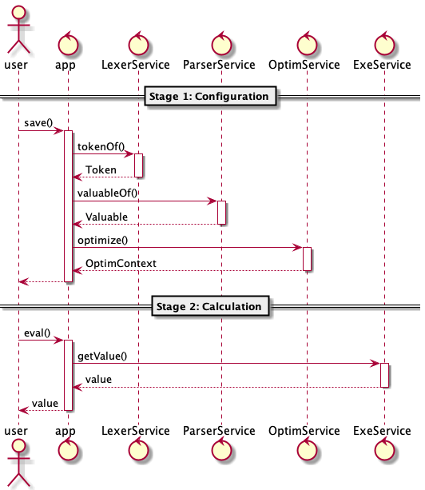

# Apollo
A calculation center.

## 2. Mechanism
### 2.1. Calculation
The calculation is carried on abstract-symbol-tree (AST).

### 2.2. Optimization

#### 2.2.1. Caching
* In-memory caching optimized codes

* In-memory caching calculation results

#### 2.2.2. Parallel calculation
* Directed-acyclic-graph (DAG) sorting

* Parallel calculation

### 2.3. Calling Sequence
